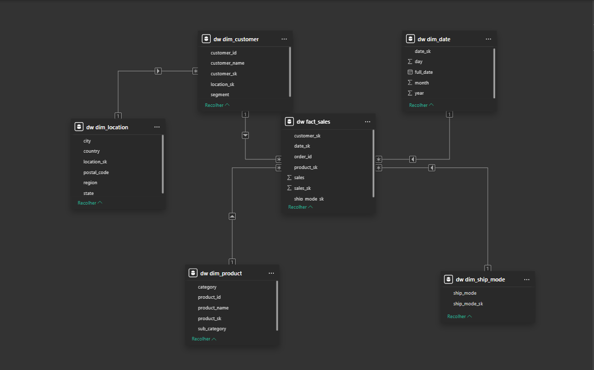

# Superstore ETL & Data Warehouse Project

Este projeto demonstra um pipeline de Engenharia de Dados completo, realizando a extração de dados brutos de um CSV (Superstore dataset), processamento de limpeza e normalização, e carga em um **Data Warehouse** modelado em **Star Schema** utilizando PostgreSQL.

---

## Arquitetura do Projeto

O projeto segue a arquitetura **Medallion-like** simplificada:
1.  **Staging Area:** Dados brutos carregados diretamente do CSV com tipagem básica.
2.  **Transform Layer:** Limpeza de nulos, padronização de strings e validação de integridade.
3.  **Data Warehouse (DW):** Modelagem dimensional (Fatos e Dimensões) para otimização de consultas e BI.


---

## 🛠️ Tecnologias Utilizadas

* **Linguagem:** Python 3.x
* **Manipulação de Dados:** Pandas
* **Banco de Dados:** PostgreSQL (Rodando via Docker)
* **ORM/Interface:** SQLAlchemy & Psycopg2
* **Visualização:** Power BI

---

## Modelagem Dimensional (Star Schema)

A estrutura do Data Warehouse foi desenhada para facilitar a análise de performance de vendas:

* **Tabela Fato:** `fact_sales` (Contém métricas e chaves estrangeiras).
* **Tabelas Dimensão:** * `dim_customer`: Dados dos clientes.
    * `dim_product`: Informações dos produtos.
    * `dim_location`: Localização geográfica das vendas.
    * `dim_date`: Dimensão tempo (granularidade de dia).
    * `dim_ship_mode`: Modos de envio.


---

## Arquitetura do Projeto



## Como Executar o Projeto


1.  **Configurar o ambiente:**
    Renomeie o `.env.example` para `.env` e preencha suas credenciais.

2.  **Subir o Banco de Dados:**
    ```bash
    docker-compose up -d
    ```

3.  **Executar o Pipeline:**
    O projeto possui um orquestrador central que executa os passos na ordem correta:
    ```bash
    python etl/main.py
    ```

---

## Data Quality (Diagnóstico)

Um diferencial deste projeto é a fase de **Data Quality**, onde realizamos o diagnóstico de `nunique` para identificar:
- Inconsistências de escrita (Ex: "Londres" vs "londres").
- Erros de integridade (1 ID de produto para múltiplos nomes).
- Monitoramento de valores nulos em colunas críticas.


---

## Boas Práticas Aplicadas

- Separação Staging × Data Warehouse
- Modelagem Star Schema
- Uso de variáveis de ambiente (.env)
- Containerização com Docker
- Pipeline reexecutável (reload seguro)
- Validação automática de dados

---

**Desenvolvido por [Josué Alexandre]**